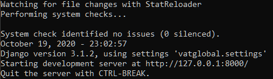

# vatglobal Assessment

##### vatglobal provides automated VAT compliance, and this is the repository for the Python assessment

### Installation

This project uses Python 3.8.6.
Ensure that you have PIP3 installed.
Enter the following commands to setup your environment and install the project.

#### Cloning the project

`git clone https://github.com/ftflfx/vatglobal.git`

#### Installing the virtual environment

Make sure that you are in the vatglobal repository

`pip3 install virtualenv`

`virtualenv vatglobalenv`

#### Activating the virtual environment in your terminal

##### For Windows

`vatglobalenv\Scripts\activate.bat`

After this, any further commands will be performed in your virtual environment

##### For MAC

`source vatglobalenv/bin/activate`

#### Install the packages

`pip install -r requirements.txt`

Once the the above is completed, you can continue to run the project

### Running the server

First, make sure that you run the migrations and migrate using the following command

`python manage.py makemigrations`

`python manage.py migrate`

`python manage.py createcachetable`

###### Cache is set to database for development purposes, but would use something like memcached for production

This will only work if you have activated your virtual environment. 
You should see (vatglobal) in your terminal, before your file path

`python manage.py runserver`

Verify that the server is running if you see the following

### Testing

To run tests, type `pytest` in the terminal within your virtual environment

### API Calls

The API has two calls. Currently there is only a single version. 

Locally, the base API domain is http://127.0.0.1:8000/api/v1/

The following are the API calls

http://127.0.0.1:8000/api/v1/coinList/

This lists all coins using the Coin Gecko API, including their ID, symbol, and name.

http://127.0.0.1:8000/api/v1/marketCap/

This gives the market cap for a particular coin. Use the following query parameters

* coin_id (as per Coin Gecko Coin List)
* date (YYYY/MM/DD) according to UTC time
* currency (ISO code)

e.g. http://127.0.0.1:8000/api/v1/marketCap/?coin_id=bitcoin&date=2020/08/20&currency=zar

### Process of Scaling Gently

Three steps were taken in scaling gently regarding the Coin Gecko API

* Use local Django and Django Rest Framework Implementation. Cache the market cap and coin list API calls.
Coin list is cached for an hour, as a business decision determining that waiting an hour for new coins in the
list is acceptable. This largely reduces the hits on the Coin Gecko API, as it will only be consumed once
every hour for the coin list. Market cap is cached for a day, so as to alleviate using the database cache 
of historical market values as much as possible. Although this value never changes, 
the fields or presentation displayed on the page may change, and so it is still set to invalidate after a day

* The market cap of a coin, date, and currency is cached because this value will never change. Instead of consuming
the Coin Gecko API, the value is fetched from the database if it exists already.

* Ensuring that the Coin Gecko API Rate Limit is not abused. The code checks whether or not the 100 requests per
minute rate limit has been reached, and, if so, let's the user known that it will be allowed to request again in
X seconds.

### Additions With Time

* Adding pagination to the coin list could be a useful feature in a future release, especially when the list of coins 
grows

* Once the database cached market cap has reached a saturation level, machine learning could be added to estimate the
market cap on a given day

### Documentation

To view documentation, visit http://127.0.0.1:8000/redoc/

### Additional

Settings would change for production, as debug would be set to false and the Django secret key would be managed
by a different dedicated environment manager